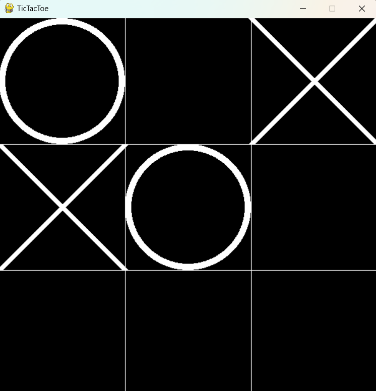

# TicTacToe
   <h1>TicTacToe Game with Pygame</h1>
   
    <h2>Overview</h2>
    
Welcome to the TicTacToe project! This is a graphical implementation of the classic TicTacToe game using Pygame, a popular Python library for game development. The project aims to provide an interactive and enjoyable gaming experience for players, with an added twist of AI-based gameplay.

    <h2>Features</h2>
    <ul>
        <li><strong>Graphical Interface:</strong> The game features a user-friendly graphical interface created using Pygame, enhancing the gaming experience with visuals and animations.</li>
        <li><strong>Object-Oriented Design:</strong> The project is developed using object-oriented programming (OOP) principles, promoting modularity and code organization. Each component of the game is encapsulated within classes, making the codebase more maintainable and extensible.</li>
        <li><strong>AI Gameplay with Minimax Algorithm:</strong> One of the highlights of this project is the incorporation of the Minimax algorithm for AI-based gameplay. Players can now challenge an intelligent opponent, testing their skills against a computer that employs strategic decision-making to play the game optimally.</li>
    </ul>
    <h2>Getting Started</h2>
    <ol>
        <li><strong>Prerequisites:</strong>
            <ul>
                <li>Ensure you have Python installed on your machine.</li>
                <li>Install Pygame by running: <code>pip install pygame</code></li>
            </ul>
        </li>
        <li><strong>Clone the Repository:</strong>
            <pre><code>git clone https://github.com/tanvir771/tictactoe
cd tictactoe</code></pre>
        </li>
        <li><strong>Run the Game:</strong>
            <pre><code>python main.py</code></pre>
        </li>
    </ol>
    
Thank you for checking out the TicTacToe project! Have fun playing and exploring the code. If you have any questions or suggestions, feel free to reach out.

    
Happy coding! 🎮

